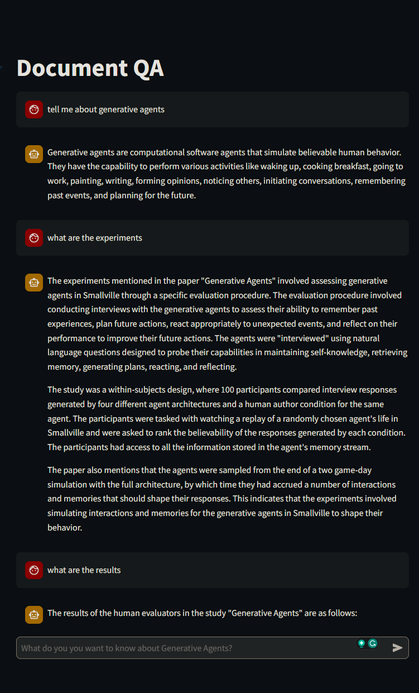
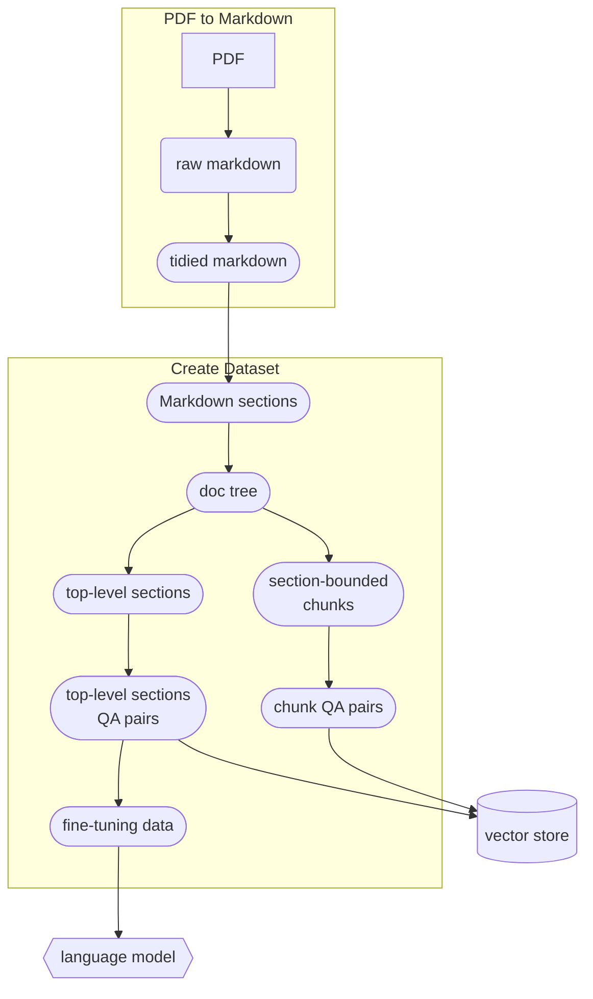
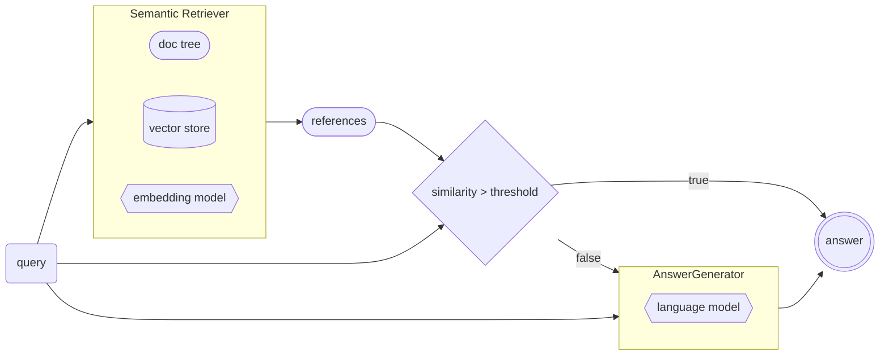

# DocQA

[](https://codeium.com)
[](https://www.python.org/downloads/release/python-31013/)
[](https://github.com/psf/black)

Ask questions on your documents.

This repo contains various tools for creating a document QA app from your text file to a RAG
chatbot.

## Installation

- `Require python >= 3.10`
- Get the source code

  ```bash
  # clone the repo (with a the lone17/marker fork as a submodule)
  git clone --recurse-submodules https://github.com/lone17/docqa.git
  cd docqa
  ```

- It is recommended to create a virtual environment

  ```bash
  python -m venv env
  . env/bin/activate
  ```

- First let's install marker (following it's instructions)

  ```bash
  cd marker
  #  Install ghostscript > 9.55 by following https://ghostscript.readthedocs.io/en/latest/Install.html
  scripts/install/ghostscript_install.sh
  # install other requirements
  cat scripts/install/apt-requirements.txt | xargs sudo apt-get install -y
  pip install .
  ```

- Then install docqa

  ```bash
  cd ..
  pip install -e .[dev]
  ```

# Demo

## Usage

This repo contains a demo for the whole pipeline for a QA chatbot on Generative Agents based on the
information
in [this paper](<docqa/demo/data/generative_agent/generative_agent%20(1).pdf>).



### From source

Before playing with the demo, please populate your key and secrets in the `.env` file:

```bash
OPENAI_API_KEY=...
OPENAI_MODEL=...
OPENAI_SEED=...
WANDB_API_KEY=...
```

All the scripts for the full pipeline as well as generated artifacts are in the `demo` folder.

- `create_dataset.py`: This script handles the full data processing pipeline:
  - parse the pdf file
  - convert it to markdown
  - chunk the content preserving structural content
  - generate question-answers pairs
  - prepare data for other steps: fine-tuning OpenAI models, adding to vector-stores.
- `finetune_openai.py`: As the name suggests, this scripts is used to fine-tune the OpenAI model
  using the data generated in `create_dataset.py`.
  - Also includes Wandb logging.
- `pipeline.py`: Declares the QA pipeline with semantic retrieval using ChromaDB.

The `main.py` script is the endpoint for running the backend app:

```bash
python main.py
```

And to run the front end:

```bash
streamlit run frontend.py
```

### From Docker

Alternatively, you can get the image from Docker Hub
[here](tps://hub.docker.com/repository/docker/el117/docqa/general).

```bash
docker pull el117/docqa
docker run --rm -p 8000:8000 -e OPENAI_API_KEY=<...> el117/docqa
```

Note that the docker does not contain the front end. To run it you can simply do:

```bash
pip install streamlit
streamlit run frontend.py
```

## Architecture

### Data pipeline

The diagram blow describes the data cycle. Result from each steps can be found at [docqa/demo/data](docqa/demo/data).



## App

The diagram below describe the app's internal working, from receiving a question to answering it.


