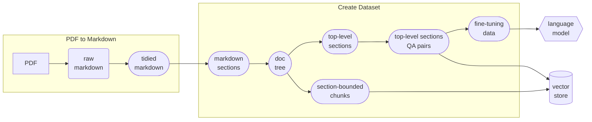
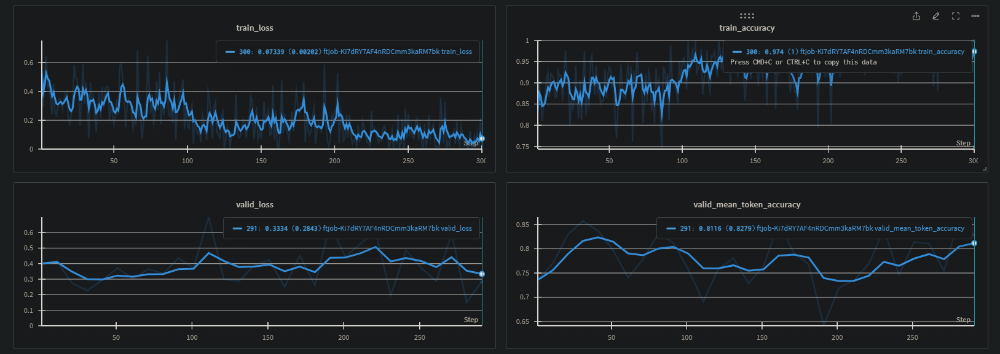
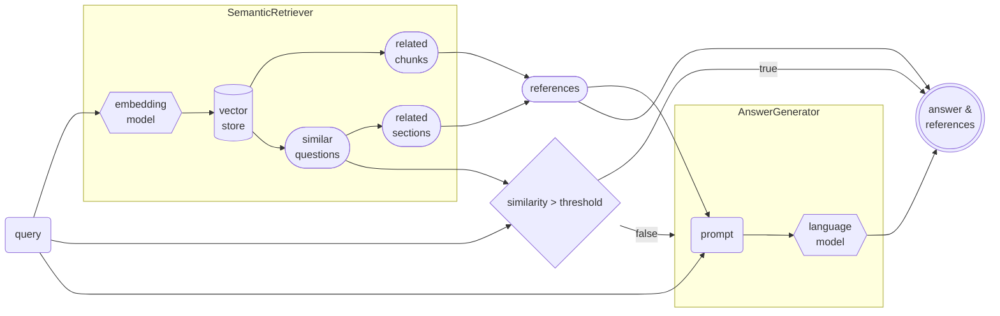

# Technical Report

## Introduction

The goal of the project was to develop a program that let users query questions about the paper Generative Agents (the source document) through a chat interface.

This document describes the process of development, with details on what has been experimented, how decisions were made, the results, and possible future improvements.

The development can be divided into 3 major parts:

1. **Data processing**: in which the paper was processed from a PDF file to a more structured and parsable format.
2. **Model development**: in which the data extracted in the previous step was used to create the training set, which was then used to fine-tune the model.
3. **App development**: in which the pipeline and logic of the chatbot were constructed using the models and data from previous steps.

## Development process

### Data processing

Overview diagram of the data processing pipeline:

!!! info "Implementation details"
    The data processing pipeline is put together in the `docqa/demo/create_dataset.py` script.

#### PDF to Markdown

##### Why Markdown?

The first step is to parse the pdf file and extract the text from it. It is preferable that the extracted text preserves the structure of the paper. This is, however, not a trivial task as PDF is notoriously hard to parse and doesn't explicitly contain structural and scheming information.

The target format of choice for this step is markdown. Markdown was chosen instead of others as it has a well-defined structure (unlike plain text) while still being readable and not over-expressive (like HTML or LaTex). It strikes a balance between structure and expressiveness.

!!! quote ""
    The Markdown format is chosen partly due to being a personal favourite.

!!! note
    Note that, for the case of the Generative Agents paper, one can get the  LaTex source from Arxiv and parse it instead, which will yield better results. However, in the spirit of handling any PDF document, it was decided to parse the PDF file directly.

##### PDF parsers

Meta has a powerful PDF parser called [Nougat](https://github.com/facebookresearch/nougat) which was designed to work on academic documents, which is very suitable for the source document. However, experiments show that it runs quite slowly. It also tries to extract text from images which is a feature that is not needed for the purpose of this project and makes the output noisier for parsing.

!!! example "Speed up Nougat"
    A possible improvement would be to disable the OCR feature of Nougat. For the scope of this project, this was not done due to time constraints.

Thus, a different parser called [Marker](https://github.com/VikParuchuri/marker) was used for the purpose of this project. It is significantly faster and produces less noise. However, it does not come without drawbacks. It uses Nougat internally along with other tools to handle different aspects of the parsing process. As a result, is a more complicated solution with many components and heuristics.

!!! info "Output"
    The markdown output from Marker is stored in [`marker_output.md`](https://github.com/lone17/docqa/blob/main/docqa/demo/data/generative_agent/marker_output.md).

!!! bug "Parser issues"
    In the specific case of the source document, Marker produced 2 noteworthy problems:

    - As it tries to detect the column layout of the document, it fails to correctly parse the first page of the document where the authors section has 3 columns while the Abstract has only 2. This results in mixed-up content on the first page. A possible reason for this might be that it failed to identify that the author section and the Abstract are separated, thus treating them as a single section with 2 columns.
    - Near the end of its pipeline is a post-processing step that makes heavy use of heuristics to combine all the extracted text into sentences and paragraphs. This process tends to not preserve the structure of the document, and combined with the first problem, creates even noisier texts.

To overcome the above problems, a [fork](https://github.com/lone17/marker) was created to:

- Adjust the post-processing heuristic to prevent over-combining the text.
- Produce a less processed text so that it can be tidied later.
- Simplify the installation process.

##### Post-processing using Language Models

To process the loosely structured text from Marker, a language model (`gpt-3.5-turbo` in this case) was employed to tidy it up into a more structured format. Language models are suitable for this task due to their ability to understand the semantic and sentence structure of the natural language.

To best preserve the structure, heading lines (begin with `#`) were extracted, and then, only the text in between 2 heading lines was sent to the language model for reconstruction, with some prompt engineering involved. Note that, an exception was made which combines the author section and the Abstract section to address the earlier-mentioned problem.

However, since the model produces outputs with a similar length as the inputs, the input length can only be at most half of the model's context length. Thus, the amount of tokens sent to the model was limited to `4096`.

The output of the model is then compared to the input using a similarity metric, this is done to minimize the chances that the model adds new content or produces an output that is too different from the input.

!!! info "Implementation details and output"
    The logic of this procedure is implemented in the [`tidy_markdown_sections`][core.markdown.tidy_markdown_sections] method, and the tidied output is stored at [`tidy_output.md`](https://github.com/lone17/docqa/blob/main/docqa/demo/data/generative_agent/tidy_output.md).

### Model development

#### Create the Dataset

After the previous step, the input of this step would be a markdown file instead of the loosely structure pdf. Thus, any markdown file can be used as input for this step onward, allowing for different data sources and formats.

##### Document tree

To better represent the document structure, a document tree is created from the markdown. A document tree is just a fancy way of saying that the hierarchy of the sections is represented in a nested manner. Which, in this case, is a JSON object.

This was done by first extracting the heading lines, deciding the heading level based on the number of `#`, and then recursively constructing the document tree.

!!! info "Output"
    The output JSON file is stored at [`doc_tree.json`](https://github.com/lone17/docqa/blob/main/docqa/demo/data/generative_agent/doc_tree.json).

##### Section-bounded Chunking

For language models, their context lengths are finite and fixed, thus too long of a context will not be utilized fully by the models. In vector stores, the texts are represented as dense vectors, thus the longer the text the harder is it to condense the content into a single vector. As such, when working with language models and vector stores, chunking is usually needed as using the entire document is not efficient.

Throughout this project, chunking is used several times. The logic for chunking is as follows:

- The chunks will be bound to a single section, meaning, no chunk is allowed to span across multiple sections. This is done by performing chunking on each section's content instead of on the entire document.
- To create a chunk, the text in a single section is first split at double newline characters (`\n\n`). This is an attempt to divide the text into paragraph candidates.
- Then, heuristics are used to combine the candidates:

    - If a candidate is longer than `single_threshold` words, then it is considered a paragraph and will be added as a chunk.
    - Otherwise, candidates are combined until they are longer than `composite_threshold` words, then it will be added as a chunk.

!!! tip "Implementation details"
    This logic is implemented in the [`chunk_content`][core.chunking.chunk_content] function.

    The choices of `single_threshold` and `composite_threshold` are 100 and 200 respectively. This was chosen because the average paragraph in English is about 100 - 200 words.

!!! example "Using language models for chunking"
    Alternatively, a language model can used to divide the text into semantic paragraphs. However, the content in the source document was already presented in short paragraphs and the parsing step preserves this structure quite well, thus the use of language models is not necessary.

##### Question-Answer Pairs

To fine-tune the model, a dataset in the form of question-answer pairs is needed. This step was done by providing a Language Model with a portion of the document and using it as the context for the model to generate questions and answers. It is important to make sure that the portions are semantically and structurally enclosed, meaning they must contain complete sentences describing complete ideas without being cut-off mid mid-context.

!!! info "Number of training data"
    Per the requirements, the number of training data used for fine-tuning was limited to 100.

###### Generating questions

It was observed that the lengths of the top-level sections fit well within the context length of the model, while still leaving plenty of room for the model's output. Thus, instead of using chunks, each entire top-level section is used for prompting the model to generate questions. Here, chunking is less desirable as whole sections are guaranteed to have semantic completeness which provides the model with better context for generation.

The language model was provided with each section as context and was asked to generate a list of questions that can be based only on the given context and must cover all information of the context, along with answers to those questions. To avoid trivial and duplicate questions, The number of questions is limited to the number of chunks (as described [above](#section-bounded-chunking)) that the text can be split into. The idea is if the text contains `k` paragraphs, then at most `k` questions corresponding to the content of each paragraph should be asked.

!!! note
    All sections were used to generate questions except for the Reference section as it does not describe the main content.

!!! info "Prompts for generating questions"
    The questions generation process was handled by the [`generate_top_sections_questions`][core.data_generation.generate_top_sections_questions] function, which uses the [`QAPairGenerator`][core.data_generation.QAPairGenerator] class.

    Two different prompts were employed, indicated by the parameter `question_type` with the value of either `sparse` or `dense`:

    - The `sparse` prompt does not limit the number of questions. Questions generated using this prompt tend to be extractive and trivial, whose answers are one or a few verbatim sentences from the context.
    - The `dense` prompt limits the number of questions to the calculated number of chunks, which forces the model to come up with "denser" questions. Questions generated using this prompt tend to be less simple and require more context to be answered.

!!! example "Potential approach for improving quantity and quality"
    - The chunks can be used to generate more focused questions. However, since the number of questions for fine-tuning is limited to 100, this was not necessary.
    - Questions quality can be improved by asking the language model to generate more abstract questions such as questions for explanation and comparison. However, these types of questions would require some manual effort to validate.
    - Negative samples (generation with irrelevant context) can be included to reduce hallucination and overconfidence.
    - Another approach to generate more and better questions is to use cross-section context. For example, pick 2 chunks from different sections and ask the model to describe the connection between them.
    - Questions that require reasoning could be generated by asking the model to:
        - generate the conclusion based on the methodology and experiment sections;
        - design the experiments based on the claims;
        - explain the results of the experiments;
        - give criticism based on the claims and the experiment results.
    - One can combine multiple question-answer pairs to make one single conversion-like sample. However, this feels like cheating on the question count limit.

###### Generating longer answers

The answers generated from the above process were short and lacked details. This is not desirable for fine-tuning datasets as the model might learn to only give short answers during inference. To generate more detailed answers, the model was prompted with the generated questions one at a time, along with the corresponding section as context.

!!! info "Implementation details and output"
    Long answers generation was implemented in the [`generate_long_answers_for_sections_questions`][core.data_generation.generate_long_answers_for_sections_questions] method which uses the [`AnswerGenerator`][core.data_generation.AnswerGenerator] class. The output is stored in the [`top_sections_qa_data_long_answers.json`](https://github.com/lone17/docqa/tree/main/docqa/demo/data/generative_agent/top_sections_qa_data_long_answers.json) file.

#### Fine-tuning with OpenAI

##### Data construction

The training data was constructed using the generated question-answer pairs and with the following parameters:

- `section_type`: denotes which sections of the paper whose questions will be included in the dataset. For the source document, the sections are categorized into 4 types defined in the [config.py](https://github.com/lone17/docqa/tree/main/docqa/demo/config.py) file:

    - `main`: sections describing the main content.
    - `summary`: the summary sections (Abstract and Conclusion).
    - `metadata`: sections that do not describe the main content.
    - `extra`: sections that contain supplementary content.

- `question_type`: either `sparse` or `dense`, as denoted in [Generating questions](#generating-questions).
- `answer_type`: either `long` or `short`, as denoted in [Generating longer answers](#generating-longer-answers).
- `prompt_type`: denotes the type of prompt that will be used:

!!! info inline end ""
    Defined in [`make_simple_sample_for_openai`][core.data_generation.make_simple_sample_for_openai].

- `simple`: intended for simple question-answer conversation, which expects the model to generate answers based on prior knowledge.

!!! info inline end ""
    Defined in [`make_instruction_sample_for_openai`][core.data_generation.make_instruction_sample_for_openai].

- `instruction`: intended for instructed question-answer conversation (RAG-based), which contains relevant information to the question and expects the model to generate an answer based on the provided context.

!!! info "Actual data configuration"
    Due to the limitation in the number of data, fine-tuning would not be sufficient to embed the document content into the model. Thus, it was decided that only a RAG-based strategy would be used in the final system.

    The final data was constructed using the following parameters:

    - For the `train` set:
        - Only the `main` sections with `dense` questions and `long` answers were used to limit the number of questions to 100.
        - Only the `instruction` prompt type was used since the intended system will be RAG-based.
    - For the `val` set:
        - Only the `summary` sections were used. The idea was any question generated from the summary would be answerable based on the main content.
        - Both `dense` and `sparse` questions were used to increase the number of samples.
        - `long` answers and `instruction` prompt type were used so that the distribution is consistent with the `train` set.

    Data generation for the source document was implemented in the [`create_dataset.py`](https://github.com/lone17/docqa/tree/main/docqa/demo/create_dataset.py) script.

##### Model Fine-tuning

The base model `gpt-3.5-turbo-1106` was fine-tuned using OpenAI's API for 3 epochs and batch size 1.

Additionally, the training progress was logged to WandB:

!!! info "Implementation details and output"
    The fine-tuning was implemented in the [`finetune_openai.py`](https://github.com/lone17/docqa/tree/main/docqa/demo/finetune_openai.py) script. The resulting model is `ft:gpt-3.5-turbo-1106:aitomatic-inc:gen-agent-v2:8dPNxr8r`.

!!! note ""
Since the training was handled by OpenAI, this project focused more on the data preparation process.

### Vector-store

!!! info "Retrieval frameworkd"
    This project employed dense retrieval (embeddings similarity search) for the retrieval process. However, there are other options that can be explored depending on the use case:

    - keyword-based (sparse retrieval)
    - re-rank (also a type of dense retrieval)
    - knowledge graph index (from LLamaIndex)

#### Choosing the embedding model

For embedding tasks, an encoder model is more suitable than a decoder one such as GPT. Furthermore, encoder models are smaller compared to the scale of LLMs and can be run locally. According to the [Massive Text Embedding Benchmark (MTEB) Leaderboard](https://huggingface.co/spaces/mteb/leaderboard), there are many open-source options to choose from that produce state-of-the-art results.

!!! info "Implementation details"
    In this project, the [WhereIsAI/UAE-Large-V1](https://huggingface.co/WhereIsAI/UAE-Large-V1) was used. This is a 335M parameter model at the size of only 1.34G which can fit most consumer-grade machines even without the need for a GPU. At the time of writing, this was ranked 3rd in the MTEB overall leaderboard, only coming after two 7B models.

    The downside of "small" encoder models like this is their small context length, which is only 512 tokens for the `UAE-Large-V1` model. This puts more emphasis on having an efficient strategy for chunking.

#### Indexing Contents

The vector store contains 2 types of entries:

- `question` entries: the [questions](#question-answer-pairs) are used to create the embedding vectors and are stored along with the answers and the heading of the related section.
- `chunk` entries: the [chunks](#section-bounded-chunking) are used to create the embedding vector and are stored along with the heading of the related section.

!!! info "Implementation details"
    ChromaDB was used for the vector store in this project. The DB creation process is implemented in the `create_chroma_db` function of the [`pipeline.py`](https://github.com/lone17/docqa/tree/main/docqa/demo/pipeline.py) script.

### RAG Application

The RAG application consists of 3 main parts: the pipeline containing the RAG logic, a backend with a chat endpoint, and a simple chat GUI.

#### RAG Pipeline

The pipeline has a `retriever` that retrieves related content from the [vector store](#vector-store) and an `answerer` that generates the answer using the output of the `retriever` as the reference. Below is an overview diagram of the pipeline:

!!! info "Implementation details"
    The pipeline is implemented in the [`pipeline.py`](https://github.com/lone17/docqa/tree/main/docqa/demo/pipeline.py) script.

##### Retriever

The [`retriever`][core.retrieval.SemanticRetriever] uses the [embedding model] (#choosing-the-embedding-model) to compute the embedding of a user's query and then uses it to retrieve related content from the [vector store](#vector-store).

Some similar questions and related chunks are retrieved, and then depending on the similarity metrics, different behaviours are expected:

- If the most similar question has a similarity score higher than a threshold, its answer will be used as the final answer.
- If the most similar question has a similarity score lower than a threshold but higher than the average similarity score of retrieved chunks, then the content of the corresponding section will be used as the `reference`.
- If the most similar question has a similarity score lower than the average similarity score of retrieved chunks, then the content of those chunks will be used as the `reference`.

##### Answerer

The [`answerer`][core.data_generation.AnswerGenerator] gets the user's query along the `reference` output from the [`retriever`][core.retrieval.SemanticRetriever] in a prompt template and send it to the [fine-tuned language model](#model-fine-tuning) to generate the answer.

#### Chat endpoint

The backend was implemented using `Pydantic` and provides a `/chat` endpoint.

The request scheme is defined by the [`ChatRequest`][types.ChatRequest] class. It not only allows the user to send the query but also to specify which model to use, the temperature and the similarity threshold for picking references.

The response scheme is defined by the [`PipelineOutput`][types.PipelineOutput] class. It contains the answer, the references, and optionally some related metadata.

#### Chat GUI

A simple chat GUI implemented using `streamlit` was also included:

